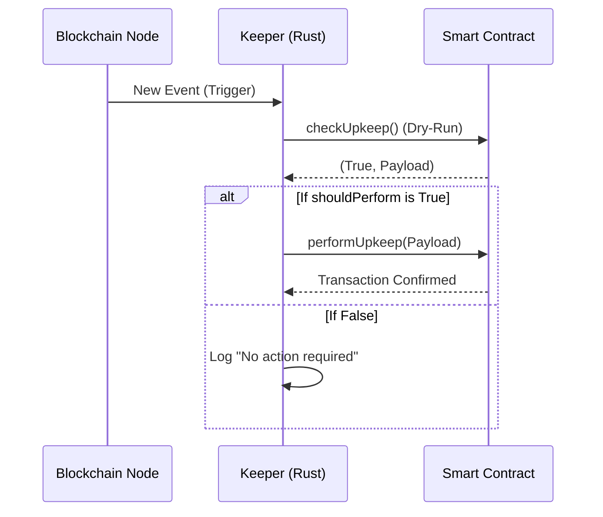

# Week 10: The Keeper Pattern (Smart Contract Watchdog)

> **This file is the concept brief.** The taught session — running clock, live demos, the break-it
> exercises, and the 40 keeper tests mapped to the claims they prove — is
> **[`KEEPERS_WORKSHOP.md`](KEEPERS_WORKSHOP.md)**. Teach from that; use the material below for the
> framing.

> **This is implemented in this repository.** `src/keeper/` (watcher, state, resolver, executor,
> metrics, mock) and `src/bin/keeper.rs`. `cargo run --bin keeper -- deploy-pool` makes the whole
> lab runnable on a bare `anvil`.


## 1. Keeper Architecture (The "Upkeep" Flow)


---

## 2. Keeper Pseudocode (src/main.rs)
This pseudocode highlights the separation of concerns: Watching, Resolving, and Executing.

```rust
// 1. The Watcher: Listens for events
async fn watch_logs(tx_trigger: mpsc::Sender<Event>) {
    let mut stream = provider.subscribe_logs(&filter).await?;
    while let Some(event) = stream.next().await {
        tx_trigger.send(event).await?;
    }
}

// 2. The Resolver: The "Brain"
async fn resolve_logic(event: Event) -> Option<TransactionRequest> {
    // Call contract checkUpkeep() to see if action is needed
    let (should_act, payload) = contract.checkUpkeep().call().await?;
    
    if should_act {
        return Some(TransactionRequest::new().data(payload));
    }
    None
}

// 3. The Executor: Dispatches the transaction
async fn execute(tx: TransactionRequest) {
    let receipt = provider.send_transaction(tx).await?.get_receipt().await?;
    println!("Action performed: {:?}", receipt.tx_hash);
}
```

---

## 3. README.md (For Student Project)
```markdown
# Keeper Watchdog Service

This service monitors a Lending Pool and executes liquidations automatically when user health factors drop below 1.0.

## Architecture
- **Watcher:** Uses `alloy` WebSocket subscriptions to listen for `Deposit` and `Withdraw` events.
- **Resolver:** Calls the on-chain `checkUpkeep()` function to verify if liquidation is required.
- **Executor:** Signs and submits the liquidation transaction using a high-priority gas strategy.

## How to Run
1. Ensure your `.env` contains `PRIVATE_KEY` and `RPC_URL`.
2. Run `cargo run`.
3. The service will begin patrolling the lending pool logs.

## Security Warning
- This service uses a simulation (dry-run) before any transaction is broadcast to prevent wasting gas on reverted liquidations.
- Always run this in a production environment with a secure secret management system, never a local `.env` file.
```
