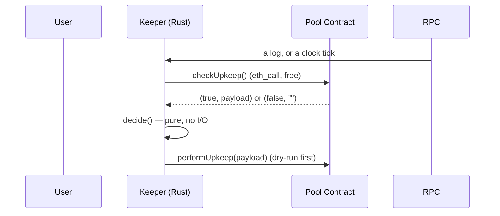

# Workshop: The Liquidation Keeper (90 minutes)

A hands-on session built entirely on this repository. Day 4 hardened a **relayer** — a service
that forwards *other people's* signed intents. This week builds a **keeper**: infrastructure that
holds a funded key, watches a contract, and decides **on its own** to spend money. Nobody asks it
to.

**Learning outcomes — by the end, students can:**

1. Explain why a keeper's condition must be decided by the *contract*, not recomputed off-chain.
2. Write a two-state state machine, find its two bugs, and repair it into four states.
3. Explain why a log subscription that "looks fine" can be silently useless, and how a timer
   changes the guarantee.
4. Demonstrate that a dry run prevents gas loss — including on a bug the unit tests missed.
5. Point at the one metric that tells you a keeper is running but not working.

**Audience:** the same as Day 4 — Rust beginners comfortable with `async`/`await`, plus basic
Ethereum concepts. Assumes Day 4 is finished, because almost every idea here is a deliberate
callback to it.

**Prerequisites:** Rust + cargo, Foundry (`anvil`, `cast`, `forge`), this repo cloned.

**There is no theory slide deck.** Every claim below is demonstrated live, and every output was
captured from this repository on anvil. The commands are the commands you type on the projector.

---

## 0. Before students arrive (10 minutes, and worth it)

1. `cargo build --all-targets` — pre-warms alloy. Every later rebuild drops to ~2–5s instead of
   several minutes. **Do not skip this.**
2. `cargo test --lib` — should print **`65 passed`**: 24 from Day 4, **41 keeper tests**. Run it
   live and say what the number means: these are the proofs for the claims you are about to make.
3. `anvil` in **T1**, leave it running.
4. Four terminals: **T1** anvil · **T2** the keeper · **T3** `crash` / `cast` · **T4** `curl` metrics.
5. Two gotchas, up front:
   - `curl 127.0.0.1:3001`, **never `localhost`**. Same IPv4-only binding trap as Day 4's `:3000`.
   - The keeper's port is **3001** and the relayer's is **3000**, so both can run at once. Compare
     the two scoreboards — the parallel is the lesson.
6. Versions everything below was captured on: rustc/cargo **1.93.0**, alloy **2.1.1**, tokio
   **1.53.1**, axum **0.8.9**, anvil/forge/cast **0.2.0**, solc **0.8.28**.

### Deploy the pool, once, before the session

There are **two doors**, and students should see both exist:

```bash
# Door 1 — no Solidity toolchain needed. Bytecode is committed in src/keeper/mock.rs.
cargo run --bin keeper -- deploy-pool

# Door 2 — compile it in front of you.
./scripts/deploy_pool.sh
```

Both deploy the same contract. **Door 1 exists because a workshop that requires `forge` to
demonstrate a 200-line idea is a workshop about installing Foundry.** Say that out loud.

Keep the printed address; every command below needs it. For the rest of this sheet it is
`<POOL>`.

---

## 1. Running clock

| Clock | Segment | The point |
|---|---|---|
| 0:00–0:08 | Framing: relayer vs keeper | The one distinction that drives everything |
| 0:08–0:28 | **Act 1:** the state machine, and its two bugs | Two states are not enough |
| 0:28–0:45 | **Act 2:** watch & resolve — the deaf subscription | "Connected" ≠ "delivering" |
| 0:45–1:02 | **Act 3:** act — the dry run earns its keep | It caught a bug the tests missed |
| 1:02–1:20 | **Act 4:** break it yourself | Four mutations, four symptoms |
| 1:20–1:30 | Wrap | Five questions + the gaps |

Protect Act 2. A keeper that is *running* and *deaf* is the most expensive mistake in this repo,
and it is invisible without a metric designed for it.

---

## 2. Framing: what is actually different? (8 min)

Put both architectures on the board.



| | Relayer (Day 4) | Keeper (this week) |
|---|---|---|
| Who initiates | a user POSTs an intent | nobody. a timer or a log |
| Who decides | the relayer, from a signature | **the contract**, from `checkUpkeep()` |
| What it signs | *other people's* calldata | one hard-coded call to one address |
| Revenue | a relayer fee | a liquidation bonus |
| Worst bug | drained by griefing | **silently stops guarding the pool** |

The last row is the one to dwell on. A broken relayer is *loud*. A blind keeper is quiet: the
pool says "nothing to do", the keeper logs `idle`, and every counter reads zero while the position
it exists to liquidate goes from 0.9 to 0.3 unobserved. Half of this session is about not shipping
that.

---

## 3. Act 1 — The state machine, and its two bugs (20 min)

Open `src/keeper/state.rs`. It is 240 lines and **all 12 of its tests run without a chain**,
because the heart of a keeper is a pure function.

### Exercise 1a: write the wrong version first (5 min)

Before reading the code, have them write the shape they expect:

```rust
enum Upkeep { Idle, Act { payload: Vec<u8> } }

fn decide(should_act: bool) -> Upkeep { /* ... */ }
```

Then break it yourself, on the board:

**Bug 1 — "no answer" and "answer is no" are the same state.**
`should_act: bool` cannot represent *"the node did not reply"*. Map that to `false` and the keeper
concludes "nothing to do" during an outage — and, worse, reports itself healthy.

**Bug 2 — `true` with no payload.**
If the contract answers `true` and gives you nothing to forward, forwarding nothing reverts in
`performUpkeep` and the keeper **pays to learn it should have done nothing**.

### Exercise 1b: the repair (10 min)

Four states, each a different operational fact:

| State | Meaning | Action | Cost of getting it wrong |
|---|---|---|---|
| `Idle` | the contract said no | log one line | — |
| `Act { payload }` | yes, and here's the payload | forward it **verbatim** | — |
| `Backoff` | **we could not find out** | retry on the next tick | treating as `Idle` = a silent keeper |
| `Refuse` | the answer exists but is unusable | spend nothing, loudly | treating as `Act` = gas burned |

`Backoff` and `Refuse` are the two students forget, and they are the two that matter. They differ
only in the *text* of the reason and they demand opposite responses from an operator: one means
"wait", the other means "fix a config file". The test
`transient_and_permanent_faults_land_in_different_states` sends the **same string** into both and
proves they land in different states.

### The rule that makes it safe (5 min)

`decide()` has **no branch that builds, edits or defaults a payload.** The payload is the
contract's decision record; any keeper-side modification is the keeper overruling the only party
that has the state. Prove it:

```bash
cargo test --lib perform_upkeep_forwards_the_payload_byte_for_byte
cargo test --lib the_trigger_never_changes_the_decision
```

The second one is the subtle one: a `Withdraw` trigger must **not** upgrade a "no" into an "act".
A keeper that treated the event as evidence — rather than as a hint that something changed — would
liquidate healthy accounts.

---

## 4. Act 2 — Watch & resolve: the deaf subscription (17 min)

`src/keeper/watcher.rs` has **two** producers feeding one queue:

```text
watch_logs  --- eth_subscribe on Deposit/Withdraw/Liquidated --+
                                                                   +--> mpsc<Trigger>
watch_ticks --- interval timer, independent of any socket -------+
```

### Why the timer is not optional (7 min)

A WebSocket subscription is a socket the node may close without telling you. A closed socket is
**indistinguishable from a quiet chain** at the application layer. No reconnect logic fixes this,
because a connection can be perfectly healthy and deliver nothing.

**The demo. This is the best ten minutes of the session.**

```bash
# T2: point the subscription at a dead port, leave everything else alone
POOL_ADDRESS=<POOL> WS_RPC_URL=ws://127.0.0.1:9999 KEEPER_POLL_SECS=4 cargo run --bin keeper
```

T2 shows, immediately and forever:

```text
⚠️  cannot connect to ws://127.0.0.1:9999: IO error: Connection refused (os error 61); retrying in 1s
⚠️  cannot connect to ws://127.0.0.1:9999: IO error: Connection refused (os error 61); retrying in 2s
⚠️  cannot connect to ws://127.0.0.1:9999: IO error: Connection refused (os error 61); retrying in 4s
```

T4:

```bash
curl -s 127.0.0.1:3001/metrics | grep -E 'subscribed|kind="tick"|from_events|consecutive'
```

```text
keeper_subscribed 0
keeper_triggers_total{kind="tick"} 4
keeper_triggers_from_events_total 0
```

**Ask the room:** is this keeper healthy? It is running, connected to the node over HTTP, resolving
`checkUpkeep()` every 4 seconds, and correctly liquidating everything. It is also *blind*, and
`keeper_triggers_from_events_total 0` with only `kind="tick"` moving is the **only** evidence. That
is why `metrics.rs` counts both kinds and computes `event_triggers()` as its own exported series.

The design consequence: **`KEEPER_POLL_SECS` is the keeper's real reaction time.** The banner says
so on purpose. Restart with `WS_RPC_URL` unset and the subscription comes back.

### The filter is the whole attack surface (5 min)

```bash
cargo test --lib the_filter_is_scoped_to_the_pool_and_the_three_events
```

Two halves, neither implied by the other:

* **address** — whose logs. Without it, another contract's identically-shaped `Deposit` matches.
* **topic0** — which events. Without it, every log the pool emits floods your queue.

topic0 alone is not enough: topic0 hashes the *signature*, not the emitting address.

> **A real bug this test caught, worth showing.** The first version of this function called
> `Filter::events([DEPOSIT_TOPIC, ...])`. But `Filter::events` takes event *signatures*
> (`"Deposit(address,uint256,uint256)"`) and **hashes them itself** — so passing pre-hashed topic0s
> **double-hashes** them, and the filter matches nothing.
>
> The symptom would have been the worst kind: a healthy, connected, permanently deaf subscription.
> `event_signature` takes topic0 values as given. If you change the filter, run this test.

### Why `Liquidated` is in the trigger set (5 min)

A competing liquidator beating the keeper is the single most common reason a keeper's next
transaction reverts. Watching the event turns a wasted transaction into a log line, and stops the
keeper re-trying an account that is already gone.

`UpkeepPerformed` is deliberately **not** subscribed — `Liquidated` already carries the outcome,
and two events per liquidation would double the trigger rate for no new information. There is a
test asserting its absence.

---

## 5. Act 3 — Act: the dry run earns its keep (17 min)

### The happy path, end to end (6 min)

```bash
# T2
POOL_ADDRESS=<POOL> KEEPER_POLL_SECS=5 cargo run --bin keeper
```

```text
┌─ liquidation keeper ────────────────────────────────────────
│ keeper address   0xa0Ee7A142d267C1f36714E4a8F75612F20a79720
│ watching pool    0x700b6A60ce7EaaEA56F065753d8dcB9653dbAD35
│ broadcast to     http://127.0.0.1:8545   ← PUBLIC mempool: a searcher can see and front-run these
│ poll every       5s   ← worst-case reaction time if the socket dies
│ priority fee     2 gwei
│ tx cap           12 per hour
│ dry run          ON  (eth_call before every performUpkeep)
│ victim health    ∞ (no debt)    (1.0000 = the liquidation line)
└─────────────────────────────────────────────────────────────
👂 subscribed to 0x700b... logs on ws://127.0.0.1:8545
·  tick / idle — no action on 0x700b...: the pool says nothing needs doing
```

Now push it under water in **T3**:

```bash
POOL_ADDRESS=<POOL> cargo run --bin keeper -- crash
```

```text
🌊 crashing the pool at 0x700b6A...
   victim           0x000000000000000000000000000000000000bEEF
   before           ∞ (no debt)
   ✓ arm a HEALTHY position mined in block Some(2)
   armed            collateral 200 / debt 100  →  health factor 2.0000
   (the keeper should log 'no action' here — nothing is wrong yet)
   ✓ withdraw collateral mined in block Some(3)
   withdrew         121  →  collateral 79 / debt 100  →  health factor 0.7900
```

**Point at the two steps.** The position starts at **2.0** — comfortably healthy — and the
`withdraw` that breaks it looks like a completely ordinary call. Nothing in that log says "liquidate
me". That is the entire argument for asking the contract instead of reading events, and students
feel it here rather than being told it.

T2 catches it on the `Withdraw` log, not on the timer:

```text
⚠️  checkUpkeep() = TRUE on 0x700b... (victim health factor 0.7900) — acting
🚀 withdraw: performUpkeep broadcast (32 byte payload, trigger 0x2cf39db7...)
✅ 0x2cf39db7... mined: liquidation performed, 72130 gas
   → liquidated, 72130 gas
·  liquidated / idle — no action on 0x700b...: the pool says nothing needs doing
```

Note the last line: the keeper saw **its own** `Liquidated` event and correctly went idle instead
of trying again.

### Prove it on chain (3 min)

```bash
# T4
curl -s 127.0.0.1:3001/metrics | grep -v '^#'
```

```text
keeper_subscribed 1
keeper_triggers_total{kind="deposit"} 1
keeper_triggers_total{kind="withdraw"} 1
keeper_triggers_total{kind="liquidated"} 1
keeper_outcomes_total{outcome="idle"} 10
keeper_outcomes_total{outcome="act"} 1
keeper_transactions_total{status="confirmed"} 1
keeper_transactions_total{status="reverted"} 0
keeper_gas_burned_on_reverts_wei 0
```

```bash
cast call <POOL> 'liquidationCount()(uint256)' --rpc-url http://127.0.0.1:8545   # 1
cast call <POOL> 'checkUpkeep()(bool,bytes)' --rpc-url http://127.0.0.1:8545     # false / 0x
```

The count on chain and the count in metrics must agree. **If they disagree, the keeper is doing
something twice** — that is the double-spend check.

### The demo that justifies the whole design (8 min)

> **This is a true story from building this lab, and it is the best argument for the dry run you
> will get all week.**

The first working version set `max_priority_fee_per_gas` and nothing else. It compiled. **Every
unit test passed.** Then it ran, and:

```text
⚠️  checkUpkeep() = TRUE on 0x700b... (victim health factor 0.7900) — acting
🛑 0xa0Ee7A14... (trigger tick) would revert -- not broadcasting:
    Invalid input: `max_priority_fee_per_gas` greater than `max_fee_per_gas` (code -32602)
   → skipped: dry run says it would revert: Invalid input: ...
   (×7, identically)
```

EIP-1559 requires `max_priority_fee_per_gas <= max_fee_per_gas`. Every node rejects the
transaction. The keeper was **correctly deciding to liquidate** and then correctly refusing to
send, seven times, at a cost of **zero gas**.

Two lessons, and both are the point of the exercise:

1. **The dry run is not a formality. It caught a bug no unit test found.** 24 Day-4 tests and 31
   keeper tests had nothing to say about it, because the bug lived in the space between what the
   type system checks and what a node accepts.
2. **The right response to a defensive layer firing repeatedly is to go read why.** The log line
   named the exact rule. Silence would have left a keeper that never liquidates and never says why.

It is now pinned:

```bash
cargo test --lib max_fee_is_above_the_priority_fee
```

### Turn the defence off, and watch money disappear (optional, 4 min)

```bash
POOL_ADDRESS=<POOL> KEEPER_DRY_RUN=0 cargo run --bin keeper
```

The banner prints `dry run OFF ⚠️`. Same as Day 4's Part 1: a **lab switch**, because a defence
you cannot switch off is a defence you cannot demonstrate. Run the `crash` twice and compare
`keeper_gas_burned_on_reverts_wei`.

---

## 6. Act 4 — Break it yourself (18 min)

Four mutations, each with a **predictable** symptom. Have them predict first, then run.

| # | Mutation | Predicted symptom | Why it matters |
|---|---|---|---|
| 1 | Delete the poll timer task in `main` | **Nothing visible happens.** The keeper is deaf and says so — `from_events 0` | The only defence against a dead socket is a timer |
| 2 | Swap `DEPOSIT_TOPIC`/`WITHDRAW_TOPIC` in `watcher_filter` | Compiles; tests fail | Two parallel arrays in two modules |
| 3 | Return `PoolAnswer::NoAction` for an empty reply in `classify` | Keeper watches nothing, reports healthy | The single worst line in the file |
| 4 | Remove the `max_fee_per_gas` line | Keeper refuses to send, repeatedly, free | Act 3's bug, on purpose |

```bash
# 1 and 2 are one-command experiments
cargo test --lib watcher

# 3 is the one to insist on: it is a one-word change that ships a silent failure.
cargo test --lib an_empty_reply_is_never_read_as_nothing_to_do
```

**Scoring, agreed up front.** A keeper is *not* secure if it refuses to act — it is broken. The
keeper wins if it liquidates the underwater position **and** `gas_burned_on_reverts_wei` stays 0.
It loses if it idles through a crash, or if it burns gas on a reversion.

### The two library behaviours that will bite you

Both were found by writing tests, not by reading docs. Both are the kind of thing that makes a
career:

**1. `abi_decode_returns_validate` does *not* reject trailing garbage.**
The obvious way to "reject junk replies" is the validating decoder. It validates the values it
decodes but never checks that it consumed the whole buffer, so a perfectly good reply with 32 bytes
of junk appended still decodes. `decode_check_upkeep` therefore does an explicit length check.

**2. Dynamic ABI payloads are padded to 32-byte words.**
A 4097-byte payload occupies **4224** bytes on the wire. Computing the expected length without the
padding rejects every payload that is not word-aligned.

```bash
cargo test --lib trailing_garbage_after_a_valid_reply_is_rejected
cargo test --lib an_oversized_payload_is_malformed_not_a_very_large_action
```

> Also: `sol!` gives `checkUpkeep()` a **named return struct** (`checkUpkeepReturn`), not a tuple.
> Destructure by field name so an ABI change becomes a compile error instead of a silent swap of two
> same-typed values. And when a test needs a well-formed ABI reply, **build it with alloy's own
> encoder** (`SolCall::abi_encode_returns`) — the first draft of these tests hand-assembled the
> dynamic-offset encoding, got it wrong, and every "well-formed" case failed.

---

## 7. Wrap (10 min): the five questions

1. **Who decides whether a liquidation is needed, and what happens if the keeper disagrees?**
2. **What is the keeper's real reaction time, and what is it when the socket is dead?**
3. **What is the one metric that tells you a keeper is running but not working?**
4. **Who pays for a failed `performUpkeep`, and how would you know?**
5. **What can make this keeper spend money that it should not?**

Then the gaps. Write these down; do not pretend:

| Gap | Why acceptable *for this lab* | What production does |
|---|---|---|
| **No backfill on restart** | the poll timer fires immediately, so a restart self-heals within one interval | scan recent blocks for already-underwater accounts before watching |
| **TOCTOU between `checkUpkeep` and `performUpkeep`** | a competing liquidator is the usual cause; the contract's `AlreadyLiquidated` guard makes the loss a bounded, *measured* reversion | private orderflow (bundles), so the race is not public |
| **Single pool, fixed roster** | `checkUpkeep` scans two known addresses | a real pool maintains an index of underwater accounts; that index is where "which accounts do I even watch?" bugs live |
| **No profitability accounting** | the mock's bonus is 2% of collateral | track realised bonus vs gas spent; a keeper that is net-negative is a liability |
| **Trigger indices are two parallel arrays** | a test keeps them in step | a typed enum, or a `match` that returns `(&'static str, &AtomicU64)` together |
| **No per-pair or multi-pool support** | classroom scope | one watcher per pool, with a shared gas budget across all of them |
| **Reconnect backoff is per-process** | a restart resets it | jittered backoff, so a fleet does not stampede a recovering node |

**Homework:** pick any two rows, write the code that closes them, and paste before/after
`/metrics` into your README. Then answer all five questions above with a line of code and a
command each.

> By the end of this week you should be able to look at any autonomous on-chain service and ask the
> two questions that decide whether it is safe: **who decides**, and **how would I know if it
> stopped working?**

---

## 8. Appendix

### 8.1 The 41 keeper tests, and the claim each one proves

Run a single one by name: `cargo test --lib <name>`.

**`state.rs` — the decision, with no chain (9)**

| Test | Claim |
|---|---|
| `a_true_verdict_forwards_the_contract_payload_verbatim` | The payload is forwarded byte-for-byte |
| `the_underwater_position_is_the_only_broadcasting_outcome` | Only `Act` broadcasts — the exercise's condition, end to end |
| `an_unreachable_pool_is_not_the_same_as_a_healthy_pool` | `Backoff` ≠ `Idle`: blind ≠ healthy |
| `backoff_is_retryable_and_carries_no_terminal_state` | An RPC blip does not require a restart |
| `a_true_verdict_with_no_payload_is_refused_rather_than_forwarded` | We never send a payload that will revert |
| `the_trigger_never_changes_the_decision` | A `Withdraw` log cannot become an action |
| `transient_and_permanent_faults_land_in_different_states` | Same text, different state, different operator response |
| `backoff_is_retryable_and_carries_no_terminal_state` | An RPC blip does not require a restart |
| `the_trigger_is_preserved_for_observability` | A keeper acting only on `manual` triggers has a dead subscription |
| `describe_is_safe_to_log` | A payload is summarised by size, never echoed into a log |

**`resolver.rs` — triage, not policy (7)**

| Test | Claim |
|---|---|
| `an_empty_reply_is_never_read_as_nothing_to_do` | An address with no code is `Malformed`, not `NoAction` |
| `well_formed_replies_are_classified_by_the_contract` | The contract's boolean is the answer |
| `a_false_verdict_with_a_payload_is_still_no_action` | Extra data does not upgrade a "no" |
| `a_true_with_an_empty_payload_is_refused_by_the_forwardable_predicate` | One definition of "a payload we will send" |
| `an_oversized_payload_is_malformed_not_a_very_large_action` | Unbounded data never reaches a signed transaction |
| `the_payload_limit_is_inclusive` | The limit is exact from both sides |
| `junk_replies_are_malformed_not_silently_idle` | Garbage never degrades to `false` |

**`abi.rs` — the boundary (10)**

| Test | Claim |
|---|---|
| `event_topics_are_the_canonical_keccaks` | topic0 values are pinned to the canonical keccaks |
| `the_three_topics_are_distinct` | One filter cannot match two different events |
| `check_upkeep_calldata_is_exactly_the_selector` | 4 bytes, no arguments crept in |
| `perform_upkeep_forwards_the_payload_byte_for_byte` | Decode the call we built; the payload is identical |
| `a_true_verdict_with_a_payload_round_trips` | Encode → decode is lossless |
| `a_false_verdict_round_trips` / `an_actionable_verdict_with_an_empty_payload_still_decodes` | Both well-formed shapes decode |
| `malformed_return_data_is_an_error_not_a_silent_false` | Truncated replies error |
| `trailing_garbage_after_a_valid_reply_is_rejected` | The validating decoder alone is **not** enough |
| `the_health_sentinel_is_not_printed_as_a_number` | `type(uint256).max` prints as `∞`, not as 78 digits |

**`executor.rs` — the only code that spends (5)**

| Test | Claim |
|---|---|
| `the_signed_transaction_targets_the_pool_and_nothing_else` | `to` is the pool; no `value`; input is only `performUpkeep(payload)` |
| `an_explicit_gas_limit_reaches_the_transaction` | The gas cap is real, and suppresses `eth_estimateGas` |
| `the_priority_fee_is_gwei_converted_to_wei` | gwei → wei, the 10⁹ that is easy to drop |
| `max_fee_is_above_the_priority_fee` | **Written after Act 3's live bug** |
| `only_broadcast_outcomes_spend_gas` | A skip and a failure are both free; a revert is not |

**`watcher.rs` — the surface (4)**, **`config.rs` — the knobs (3)**, **`mock.rs` — the lab (3)**
run as described in the acts above; `cargo test --lib watcher`, `... config`, `... mock` isolate
them.

### 8.2 Command reference

```bash
# one-shot
cargo run --bin keeper -- deploy-pool     # deploy the pool from embedded bytecode
cargo run --bin keeper -- status          # ask the pool what it thinks, act on nothing
cargo run --bin keeper -- crash           # healthy position -> withdraw past the line

# the keeper itself
POOL_ADDRESS=<POOL> cargo run --bin keeper
POOL_ADDRESS=<POOL> KEEPER_POLL_SECS=5 cargo run --bin keeper
POOL_ADDRESS=<POOL> WS_RPC_URL=ws://127.0.0.1:9999 cargo run --bin keeper   # deaf on purpose
POOL_ADDRESS=<POOL> KEEPER_DRY_RUN=0 cargo run --bin keeper                # lab switch

# scoreboard
curl -s 127.0.0.1:3001/metrics | grep -v '^#'
curl -s 127.0.0.1:3001/health
curl -s -X POST 127.0.0.1:3001/upkeep     # nudge it now; the contract still decides

# reset between runs (restarting anvil wipes the pool too)
cast send <POOL> 'reset(address)' 0x000000000000000000000000000000000000bEEF --private-key <KEY>
```

> `reset` is **owner-only** — it is the deploying key. `cargo run --bin keeper -- crash` calls
> `armVictim`, which is permissionless and clears the `liquidated` flag, so in most cases you do not
> need `reset` at all.

### 8.3 Troubleshooting

| Symptom | Cause |
|---|---|
| `POOL_ADDRESS … has NO CODE` | You have not deployed. `cargo run --bin keeper -- deploy-pool` |
| `cannot connect to ws://…` | Port 8545 is HTTP. Set `WS_RPC_URL=ws://127.0.0.1:8546` |
| `POOL_ADDRESS … is a different contract` | The address answers but its `VICTIM` is wrong — usually a stale deployment from a previous anvil |
| `dry run says it would revert` repeatedly | Read the reason. It names the rule you broke (this is how the fee bug presented) |
| `cannot bind 127.0.0.1:3001` | Another keeper is running: `lsof -nP -iTCP:3001 -sTCP:LISTEN` |
| Keeper idles while the pool is underwater | `reset`/`armVictim` was called after a liquidation without clearing the flag — or check `from_events` |
